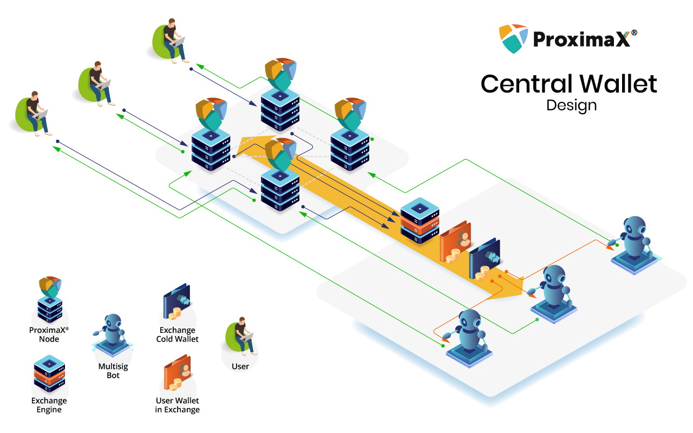
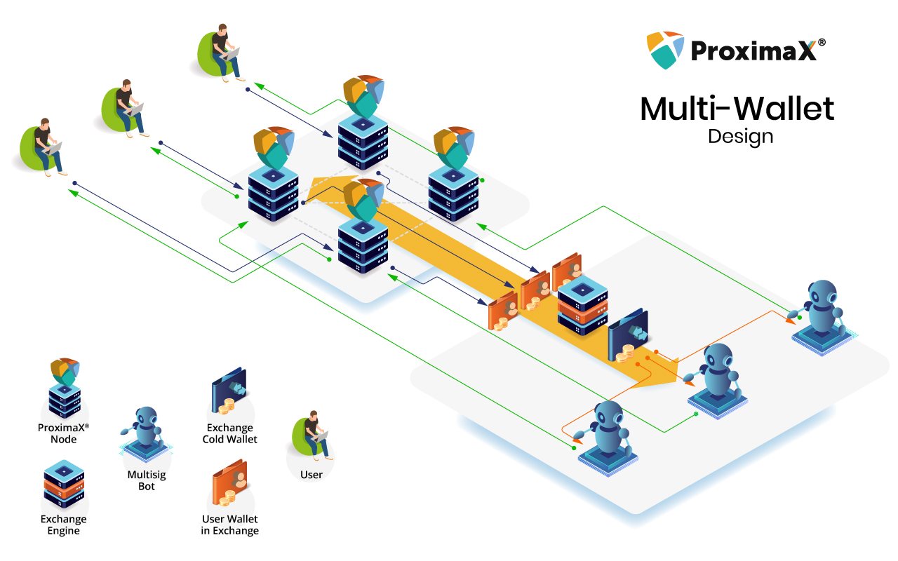
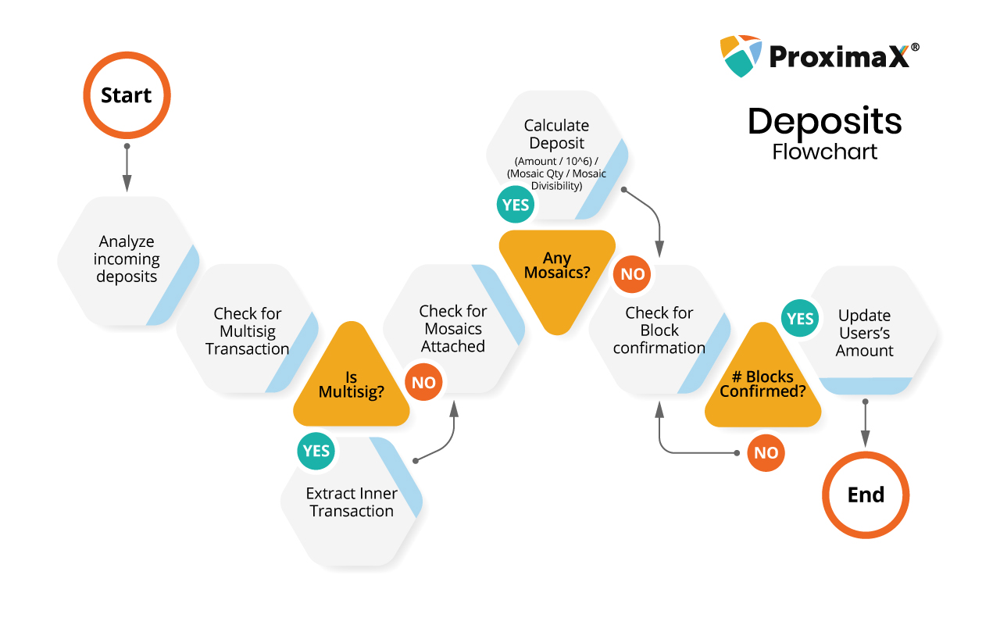

## XPX Exchange Support

This document serves as a guide for Exchanges to list XPX and the designs listed are common among many exchanges but I would like to invite exchanges to contribute to this document should there be a better design.

**_Also, it is strongly encouraged that Exchanges do not enable harvesting and most of the Exchanges has agreed to this in the spirit of community_**

### Central Wallet Design

- All deposits and withdrawals happen in a central wallet.
- Using the Message feature in Sirius Chain, users are identified by their UID on the Exchange’s own database. The UID is only shown to the user’s dashboard during the deposit confirmation.
- Exchange should have the central wallet and it is recommended to have it set up with the Multisig feature in Sirius Chain. In addition, it is advised to have a cold wallet to hold a certain threshold for the pool of XPXs.
- With the Multisig feature in Sirius Chain, withdrawals can be automated using bots communicating with different nodes to ensure proper security with user 2FA.
- Drawback to this design is that many users are not accustomed to having a Message attached to their transactions which may cost the exchange lots of tickets in their support.
- This design is shown below:
  - Black lines represent the deposits
  - Green lines represent the withdrawals
  - Red lines represent co-signing bots

### Multi-wallet Design

- All user accounts on the exchange have their own independent Sirius Chain address.
- The Sirius Chain address private keys are managed by the exchange through their own security measures.
- Deposits all happen directly with the Sirius Chain address of the user’s wallet, however the funds are transferred automatically to a central wallet which is used for withdrawals. This central wallet should follow the above design in ensuring proper security, i.e. using a cold wallet and the Multisig feature of Sirius Chain.
- Drawback to this design is that exchange will need to ensure strong security to protect the private keys from being compromised.
- This design is shown below:
  - Black lines represent the deposits
  - Green lines represent the withdrawals
  - Red lines represent co-signing bots

### Deposits

One of the unique features of Sirius Chain is that XPX is one of the mosaic that get transfered in Transfer Transaction.

On listening to incoming deposits, it is also important to take note of the various transaction types to ensure proper update of the user’s dashboard, and it is advisable to always wait for about 3 blocks confirmation before crediting the values to the user’s dashboard. The flow to handle the various transaction and determining the exact amount of XPXs deposit is shown below. This flow also ensures that the exchange system will support any Mosaics built on Sirius Chain, which allows a user to send 1 transaction but deposit up to a maximum of 10 Mosaics. However, the actual listing of the Mosaics will depend very much on the exchange and the Mosaic owner.

### Example of Transactions

Check out the list of transactions
[Examples](example.md)
